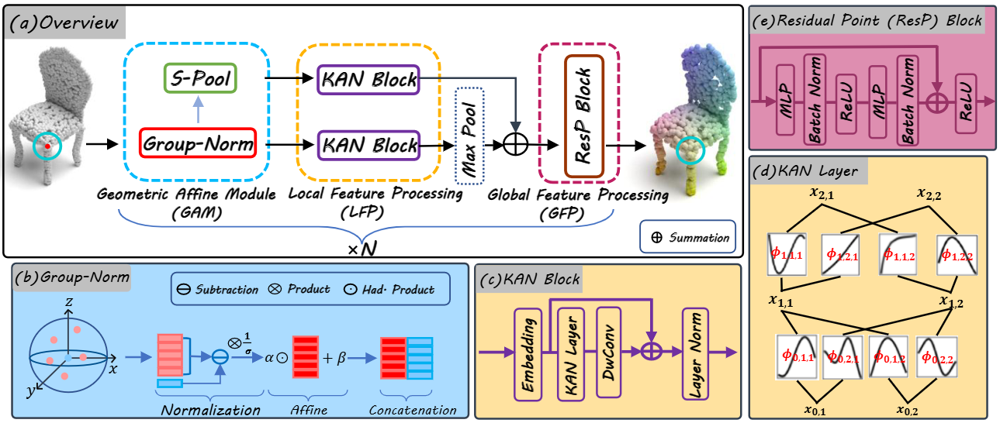

# KAN or MLP? Point Cloud Shows the Way Forward

<div align="center">
  
</div>


Illustration of PointKAN. (a) Overview of one stage in PointKAN. The entire model consists of four stages (N = 4). In each stage, local features are first transformed using a Geometric Affine Module (GAM). Grouped features are then extracted during the Local Feature Processing (LFP). After feature aggregation, global information is supplemented, and finally, overall features are obtained through the Global Feature Processing (GFP). By repeating multiple stages, the receptive field is gradually enlarged, enabling the model to obtain complete geometric information of the point cloud. (b) Group-Norm details. It mainly consists of three parts: normalization, affine transformation, and feature concatenation. (c-d) Details of the KAN Block and KAN Layer. (e) The Residual Point (ResP) Block is composed of MLP, Batch Normalization, and activation function (ReLU).

## Install

```bash
# step 1. clone this repo
git clone https://github.com/Shiyan-cps/PointKAN-pytorch.git
cd PointKAN-pytorch
```

```bash
# step 2: install libs step by step
conda create -n pointkan python=3.8 -y
conda activate pointkan
conda install pytorch==2.0.0 torchvision==0.15.0 cudatoolkit=11.8 -c pytorch -y
pip install cycler einops h5py pyyaml==5.4.1 scikit-learn==0.24.2 scipy tqdm matplotlib==3.4.2
pip install pointnet2_ops_lib/.
pip install -e rational_kat_cu/.
```


## Useage

### Classification ModelNet40
**Train**: The dataset has been already downloaded, run following command to train.

By default, it will create a folder named "checkpoints/{modelName}-{msg}-{randomseed}", which includes args.txt, best_checkpoint.pth, last_checkpoint.pth, log.txt, out.txt.
```bash
cd classification_ModelNet40
# train pointKAN
python main.py --model pointKAN
# please add other paramemters as you wish.
```

### Classification ScanObjectNN

The dataset has been already downloaded

- Train pointKAN 
```bash
cd classification_ScanObjectNN
# train pointKAN
python main.py --model pointKAN
# please add other paramemters as you wish.
```
By default, it will create a fold named "checkpoints/{modelName}-{msg}-{randomseed}", which includes args.txt, best_checkpoint.pth, last_checkpoint.pth, log.txt, out.txt.


### Part segmentation
The dataset has been already downloaded

- Train pointKAN
```bash
# train pointKAN
python main.py --model pointKAN
# please add other paramemters as you wish.
```
### PointKAN-elite
The usage process is similar to PointKAN, simply replace the parameters with pointKANElite.

- Train pointKANElite
```bash
# train pointKANElite
python main.py --model pointKANElite
# please add other paramemters as you wish.
```

## Dataset

All the datasets can be obtained from the following link.
[dataset](https://pan.baidu.com/s/1fqmSGecqWkHLaCQPMPA7kQ)
extraction code: 3qfd

## Acknowledgment

Our implementation is mainly based on the following codebases. We gratefully thank the authors for their wonderful works.

[PointMLP](https://github.com/ma-xu/pointMLP-pytorch),
[Kolmogorov-Arnold Networks](https://github.com/Blealtan/efficient-kan),
[Kolmogorov-Arnold Transformer](https://github.com/Adamdad/kat),
[Pointnet2_PyTorch](https://github.com/erikwijmans/Pointnet2_PyTorch)


## LICENSE
PointKAN is under the Apache-2.0 license. 
